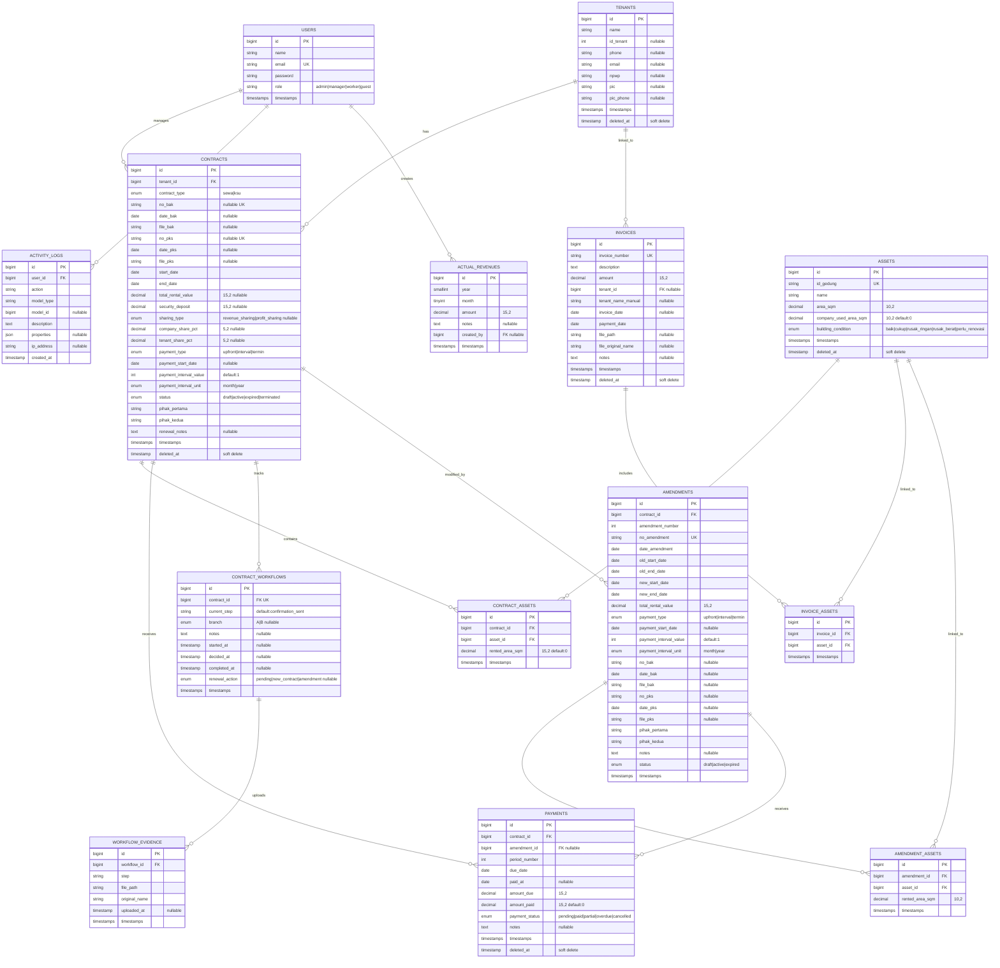

# 📊 Contract Monitoring System

A comprehensive **Contract Monitoring System** built with Laravel 12 for managing tenants, assets, contracts, payments, invoices, amendments, and contract workflows. The system features role-based access control, a dynamic dashboard, and a visual workflow tracking interface.

---

## 🚀 Tech Stack

| Layer       | Technology                                    |
|-------------|-----------------------------------------------|
| Backend     | PHP 8.2.4, Laravel 12, Laravel Sanctum         |
| Frontend    | Blade Templates, TailwindCSS 4, Alpine.js     |
| Charts      | ApexCharts                                     |
| Alerts      | SweetAlert2                                    |
| Build Tool  | Vite 7                                         |
| Database    | MySQL / MariaDB                                |

---

## ✨ Features

- **Tenant Management** — Create, view, and manage tenant information
- **Asset Management** — Track and organize company assets with company-used area tracking
- **Contract Management** — Full contract lifecycle with start/end dates and associated assets (Sewa & KSU types)
- **Contract Amendments** — Support for contract modifications and renewals
- **Payment Tracking** — Record and monitor payments linked to contracts and amendments
- **Invoice Generation** — Create and manage invoices with tenant association and file uploads
- **Workflow System** — Visual step-by-step contract workflow with evidence uploads
- **Renewal Workflow** — Automated renewal process with choice to create new contract or amendment
- **Accrual & Actual Revenue** — Monthly revenue tracking with accrual vs actual comparison charts
- **Activity Logging** — Track user actions across the system for audit purposes
- **Dashboard** — Dynamic overview with charts, expiring contracts alerts, overdue payments, and key metrics (YTD)
- **Role-Based Access** — Multi-role authentication (admin, manager, worker, guest) powered by Laravel Sanctum
- **Forgot Password** — Email-based password recovery flow
- **User Management** — Admin panel for managing user accounts and roles

---

## 📋 Prerequisites

- **PHP** >= 8.2.4
- **Composer** >= 2.x
- **Node.js** >= 18.x & **npm**
- **MySQL** or **MariaDB**

---

## ⚙️ Installation

### 1. Clone the repository

```bash
git clone <repository-url>
cd monitoring
```

### 2. Install PHP dependencies

```bash
composer install
```

### 3. Install Node.js dependencies

```bash
npm install
```

### 4. Environment setup

```bash
cp .env.example .env
php artisan key:generate
```

Configure your database credentials in the `.env` file:

```env
DB_CONNECTION=mysql
DB_HOST=127.0.0.1
DB_PORT=3306
DB_DATABASE=monitoring
DB_USERNAME=root
DB_PASSWORD=your_password
```

### 5. Run database migrations

> **⚠️ Important:** This project uses migration files located in the `database/migrations/data/` directory. You must specify this path when running migrations.

```bash
php artisan migrate --path=database/migrations/data
```

<details>
<summary>📄 Migration files included</summary>

| # | Migration File | Description |
|---|----------------|-------------|
| 1 | `0001_01_01_000000_create_users_table.php` | Users, password resets, and sessions tables |
| 2 | `0001_01_01_000001_create_cache_table.php` | Cache and cache locks tables |
| 3 | `0001_01_01_000002_create_jobs_table.php` | Jobs, job batches, and failed jobs tables |
| 4 | `2026_01_07_010000_create_tenants_table.php` | Tenants table |
| 5 | `2026_01_07_010001_create_assets_table.php` | Assets table (with company_used_area_sqm) |
| 6 | `2026_01_07_010002_create_contracts_table.php` | Contracts table (Sewa & KSU types, flexible payment) |
| 7 | `2026_01_07_010003_create_contract_assets_table.php` | Contract-Asset pivot table |
| 8 | `2026_01_07_010004_create_payments_table.php` | Payments table (with amendment_id FK) |
| 9 | `2026_02_03_100000_add_role_to_users_table.php` | Adds role column to users (admin, manager, worker, guest) |
| 10 | `2026_02_20_021059_create_contract_workflows_table.php` | Contract workflows table (with renewal_action) |
| 11 | `2026_02_20_021105_create_workflow_evidence_table.php` | Workflow evidence uploads table |
| 12 | `2026_02_24_023848_create_invoices_table.php` | Invoices table (post-payment model with tenant association) |
| 13 | `2026_02_24_023925_create_invoice_assets_table.php` | Invoice-Asset pivot table |
| 14 | `2026_02_27_040000_create_amendments_table.php` | Contract amendments table (+ payments FK constraint) |
| 15 | `2026_02_27_040001_create_amendment_assets_table.php` | Amendment-Asset pivot table |
| 16 | `2026_03_31_100001_create_activity_logs_table.php` | Activity logs table for user action tracking |
| 17 | `2026_05_07_100000_create_actual_revenues_table.php` | Actual revenues table for monthly revenue input |

</details>

### 6. Run database seeders

> **⚠️ Important:** Use `DatabaseSeeder2` to seed all required data in the correct order with a single command.

```bash
php artisan db:seed --class=DatabaseSeeder2
```

<details>
<summary>📄 Seeders executed by DatabaseSeeder2</summary>

| Order | Seeder | Description |
|-------|--------|-------------|
| 1 | `TenantSeeder` | Seeds tenant records |
| 2 | `TestAsset` | Seeds asset/property records |
| 3 | `TestContractSeeder2` | Seeds contracts linked to tenants |
| 4 | `ContractAsset2` | Seeds the contract-asset relationships |
| 5 | `PaymentSeeder2` | Seeds payment records for contracts |

</details>

### 7. Build frontend assets

```bash
npm run build
```

### 8. Start the development server

```bash
php artisan serve
npm run dev
```

Or use the composer shortcut to run everything concurrently:

```bash
composer dev
```

The application will be available at **http://localhost:8000**.

---

## 📁 Project Structure

```
monitoring/
├── app/
│   ├── Http/Controllers/
│   │   ├── ActivityLogController.php
│   │   ├── ActualRevenueController.php
│   │   ├── AmendmentController.php
│   │   ├── AssetController.php
│   │   ├── ContractController.php
│   │   ├── DashboardController.php
│   │   ├── ExpiringContractController.php
│   │   ├── ForgotPasswordController.php
│   │   ├── InvoiceController.php
│   │   ├── LoginController.php
│   │   ├── OverduePaymentController.php
│   │   ├── PaymentController.php
│   │   ├── ProfileController.php
│   │   ├── RegisterController.php
│   │   ├── TenantController.php
│   │   ├── UserManagementController.php
│   │   └── WorkflowController.php
│   └── Models/
│       ├── ActivityLog.php
│       ├── ActualRevenue.php
│       ├── Amendment.php
│       ├── Asset.php
│       ├── Contract.php
│       ├── ContractWorkflow.php
│       ├── Invoice.php
│       ├── Payment.php
│       ├── Tenant.php
│       ├── User.php
│       └── WorkflowEvidence.php
├── database/
│   ├── migrations/data/       # ⭐ Production migration files (consolidated)
│   ├── seeders/               # Database seeders
│   │   ├── DatabaseSeeder2.php    # ⭐ Main seeder (use this)
│   │   ├── TenantSeeder.php
│   │   ├── TestAsset.php
│   │   ├── TestContractSeeder2.php
│   │   ├── ContractAsset2.php
│   │   └── PaymentSeeder2.php
│   └── factories/             # Model factories
├── resources/
│   └── views/                 # Blade templates
│       ├── activity-logs/     # Activity log views
│       ├── amendments/        # Amendment views
│       ├── assets/            # Asset views
│       ├── contracts/         # Contract views
│       ├── emails/            # Email templates
│       ├── expiring-contracts/# Expiring contracts "See More" page
│       ├── invoices/          # Invoice views
│       ├── layouts/           # Layout templates
│       ├── login/             # Auth views
│       ├── overdue-payments/  # Overdue payments "See More" page
│       ├── payments/          # Payment views
│       ├── pending-renewals/  # Pending renewal views
│       ├── profile/           # User profile views
│       ├── tenants/           # Tenant views
│       ├── users/             # User management views
│       ├── dashboard.blade.php
│       ├── workflow.blade.php
│       └── workflow-renewal-choice.blade.php
├── routes/
│   └── web.php                # Route definitions
├── public/                    # Public assets
└── config/                    # Configuration files
```

---

## 🗄️ Database Schema



---

## 👤 Author

**Evan** — Developer & Maintainer

---

## 📄 License

This project is licensed under the **MIT License**.

```
MIT License

Copyright (c) 2026 Evan

Permission is hereby granted, free of charge, to any person obtaining a copy
of this software and associated documentation files (the "Software"), to deal
in the Software without restriction, including without limitation the rights
to use, copy, modify, merge, publish, distribute, sublicense, and/or sell
copies of the Software, and to permit persons to whom the Software is
furnished to do so, subject to the following conditions:

The above copyright notice and this permission notice shall be included in all
copies or substantial portions of the Software.

THE SOFTWARE IS PROVIDED "AS IS", WITHOUT WARRANTY OF ANY KIND, EXPRESS OR
IMPLIED, INCLUDING BUT NOT LIMITED TO THE WARRANTIES OF MERCHANTABILITY,
FITNESS FOR A PARTICULAR PURPOSE AND NONINFRINGEMENT. IN NO EVENT SHALL THE
AUTHORS OR COPYRIGHT HOLDERS BE LIABLE FOR ANY CLAIM, DAMAGES OR OTHER
LIABILITY, WHETHER IN AN ACTION OF CONTRACT, TORT OR OTHERWISE, ARISING FROM,
OUT OF OR IN CONNECTION WITH THE SOFTWARE OR THE USE OR OTHER DEALINGS IN THE
SOFTWARE.
```
